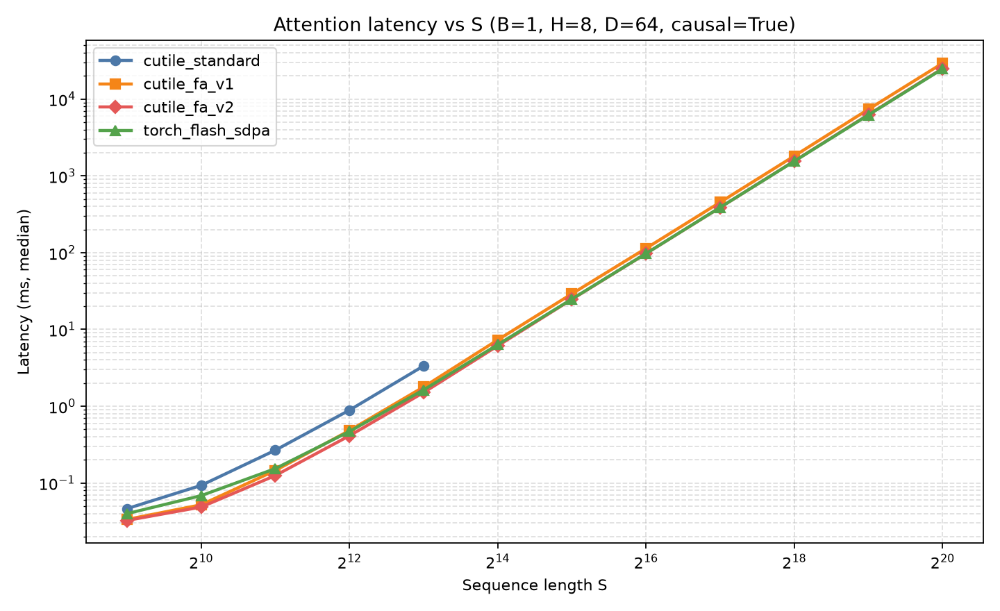
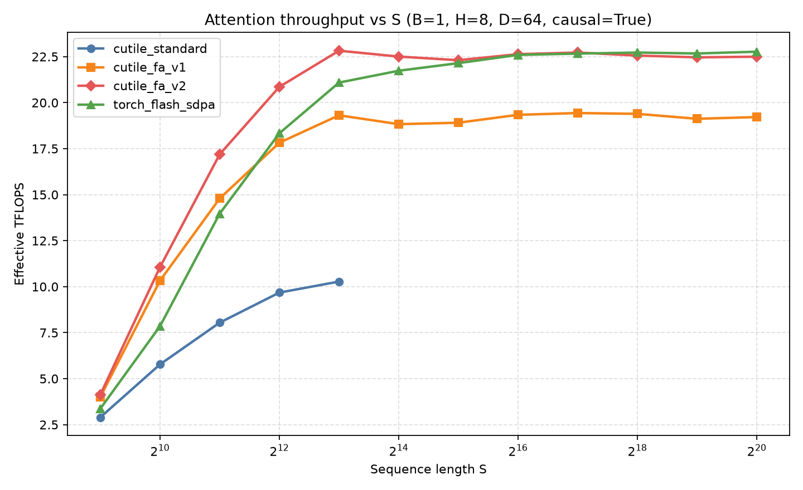
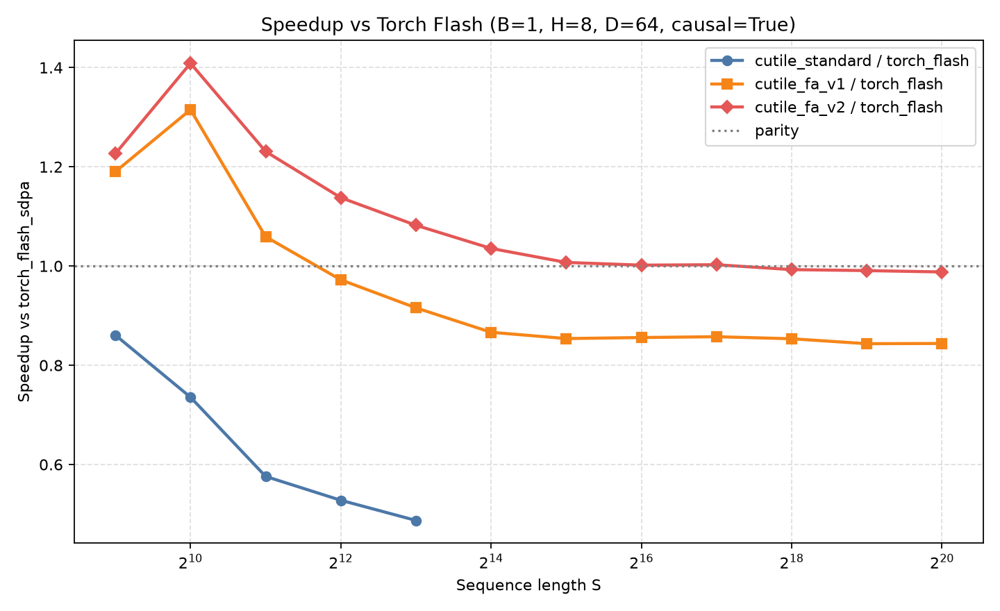

# cuTile FlashAttention

用 [cuTile Python](https://docs.nvidia.com/cuda/cutile-python)（`cuda.tile`）实现并对比：

| 实现 | 说明 |
|------|------|
| **Standard** | 两遍 KV 扫描：先算 row-max / row-sum，再算 `P@V`（无 online rescale） |
| **FlashAttention-v1** | 经典 online softmax，每 tile rescale `O`/`L`，统一 KV 循环 |
| **FlashAttention-v2** | online softmax + 因果循环拆分（无 mask 前缀 / 对角线）+ `exp2`/`APPROX` 收尾 |
| **Torch Flash SDPA** | `torch.nn.functional.scaled_dot_product_attention` + `FLASH_ATTENTION` 后端（库基准） |
| **flash-attn**（可选） | Dao et al. 官方包；在 sm_120 上可能无法安装 |

正确性以 **FP32 math SDPA** 为 ground truth。

## 环境

```bash
conda activate cutile
# 已验证: cuda-tile 1.5.0, torch 2.11+cu128, GPU sm_120 (RTX 5060 Ti)
cd /path/to/flashattn_cutile
```

可选安装官方 flash-attn（失败不影响主流程；本机 sm_120 上曾因 GitHub wheel 404/超时未能装上，对比默认使用 Torch Flash SDPA）：

```bash
pip install psutil
MAX_JOBS=4 pip install flash-attn --no-build-isolation
```

## 布局与 API

张量布局均为 `[B, H, S, D]`，dtype 推荐 `bfloat16`。

```python
from attention import (
    standard_attention,
    flash_attention_v1,
    flash_attention_v2,
    attention_math,
    attention_torch_flash,
)

out = flash_attention_v2(q, k, v, is_causal=True)
```

## 测试

```bash
python -m pytest tests/test_correctness.py -v
```

## 基准测试

```bash
# 冒烟（少量 shape）
python -m bench.benchmark --quick

# 完整扫表: B∈{1,2} H∈{8,16} S∈{512..4096} D∈{64,128} causal∈{T,F}
python -m bench.benchmark --warmup 5 --iters 20
```

输出列：

- `ms`：CUDA event 中位延迟
- `speedup`：相对 `cutile_fa_v1`
- `max|Δmath|` / `mean|Δmath|`：相对 FP32 math 的绝对误差
- `max|Δflash|`：相对 Torch Flash SDPA 的绝对误差

### 序列长度扫点 + 曲线（S ∈ [512, 1M]）

默认在 `512, 1K, 2K, …, 1M`（12 个 log2 点）上测 latency / TFLOPS，并出图：

```bash
# 全点位（大 S 较慢；standard 仅跑到 8K；>8K 不做 math 精度）
python -m bench.sweep_seqlen --out results/seqlen_sweep

# 快速：S 截断到 16K
python -m bench.sweep_seqlen --quick --out results/seqlen_quick

# 自定义范围 / 点位
python -m bench.sweep_seqlen --min-s 512 --max-s 65536
python -m bench.sweep_seqlen --seq-lens 512,2048,8192,65536,262144,1048576
```

产物（默认 `results/`）：

- `seqlen_sweep.csv`
- `seqlen_sweep_latency.png` — 延迟 vs S（log-log）
- `seqlen_sweep_tflops.png` — 等效 TFLOPS vs S
- `seqlen_sweep_speedup.png` — 相对 Torch Flash 的加速比

默认配置：`B=1, H=8, D=64, causal=True`（约 15GB 卡上 S=1M 的 QKV+O 约 4GiB；若 OOM 会跳过该点）。

## 实测结果（RTX 5060 Ti / sm_120）

配置：`B=1, H=8, D=64, causal=True, bf16`；S 取 `[512, 1M]` 共 12 个 log2 点。  
`cutile_standard` 仅测到 S=8192；原始数据见 [`results/seqlen_sweep.csv`](results/seqlen_sweep.csv)。

### 曲线







### 延迟与吞吐（摘录）

| S | standard (ms) | fa_v1 (ms) | fa_v2 (ms) | torch_flash (ms) | fa_v2 TFLOPS | torch TFLOPS |
|---:|---:|---:|---:|---:|---:|---:|
| 512 | 0.046 | 0.034 | **0.033** | 0.040 | 4.1 | 3.4 |
| 1K | 0.093 | 0.052 | **0.049** | 0.068 | 11.1 | 7.9 |
| 2K | 0.267 | 0.145 | **0.125** | 0.154 | 17.2 | 14.0 |
| 4K | 0.888 | 0.482 | **0.412** | 0.469 | 20.9 | 18.3 |
| 8K | 3.34 | 1.78 | **1.51** | 1.63 | 22.8 | 21.1 |
| 16K | — | 7.30 | **6.11** | 6.32 | 22.5 | 21.7 |
| 32K | — | 29.1 | **24.6** | 24.8 | 22.3 | 22.1 |
| 64K | — | 114 | **97.2** | 97.3 | 22.6 | 22.6 |
| 128K | — | 453 | **387** | 388 | 22.7 | 22.7 |
| 256K | — | 1814 | 1560 | **1548** | 22.6 | 22.7 |
| 512K | — | 7359 | 6265 | **6207** | 22.5 | 22.7 |
| 1M | — | 29295 | 25023 | **24723** | 22.5 | 22.8 |

要点：

- 中短序列上 **fa_v2** 通常最快，并略优于 Torch Flash SDPA。
- 大 S（≥256K）时 **fa_v2 ≈ Torch Flash**（约 22.5–22.8 TFLOPS）；**fa_v1** 稳定约 ~19 TFLOPS。
- **standard** 明显更慢，且扫点脚本在 S>8K 后跳过。

## 目录

```
attention/
  standard.py      # 两遍 standard
  flash_v1.py      # FA-v1
  flash_v2.py      # FA-v2
  reference.py     # math / torch flash / flash_attn
  utils.py
bench/benchmark.py
bench/sweep_seqlen.py
results/           # 扫点 CSV 与曲线图
tests/test_correctness.py
```

## 说明

- 仅 **forward**；首版为标准 MHA（`H_q == H_kv`），无 GQA/varlen/backward。
- sm_120 上 TileGym / NVIDIA Blog 推荐默认 tile `64×64`；FA-v2 使用 `occupancy=2`。
- bf16 下相对 FP32 math 的 `max_abs` 约 `1e-3`–`1e-2` 量级属正常范围。
